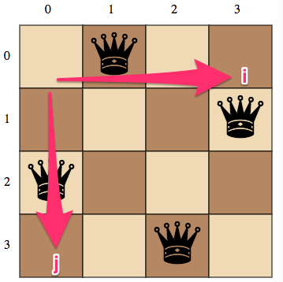

# Thuật toán 8 quân hậu
Để chạy
```bash
git clone https://github.com/TechMaster/chess_queen
cd chess_queen
yarn install
npm start
```
Dùng browser mở http://localhost:3000

Ứng dụng được viết bằng Snap.svg và Express

# Phân tích thuật toán
Giả định bàn cờ kích thước 4 x 4
Mỗi solution ký hiệu bằng một mảng solution[1..n], trong đó solution[i] = j là cột mà quân hậu ở hàng thứ i đứng.
Ví dụ: [1, 3, 0, 2] => (Hàng 0, Cột 1),  (Hàng 1, Cột 3), (Hàng 2, Cột 0), (Hàng 3, Cột 3)



Mô phỏng bước chạy


**row = 0**

    Hàng 0 chọn toàn bộ các ô

    [[0], [1], [2], [3]]

**row = 1**

    Lấy từng solution ra, duyệt qua các ô hàng 1, chọn được thì thêm, không chọn được loại
    [[0, 2], [0, 3], [1, 3], [2, 0], [3, 0], [3, 1]]

**row = 2**

  - [0, 2] fail remove
  - [0, 3, 1]
  - [1, 3, 0]
  - [2, 0, 3]
  - [3, 0, 2]
  - [3, 1] fail remove

**row = 3**

  - [0, 3, 1] fail remove
  - [1, 3, 0, 2] Final solution!
  - [2, 0, 3, 1] Final solution!
  - [3, 0, 2] fail remove
